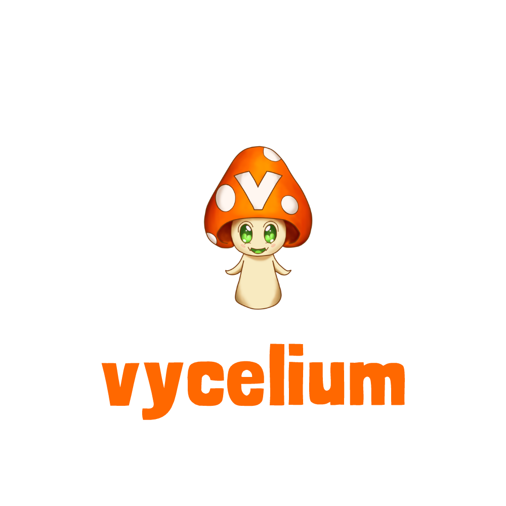

# Vycelium


    
## Description
Vycelium is a social-media application designed for the Virtual YouTuber Lifestyle.  It's target audience is VTubers, Artists, and fans of VTubers. 
## Table of Contents
- [Technologies](#technologies)
- [Deployment](#deployment)@
- [Using Vycelium Locally](#using_vycelium_locally)
- [Author](#author)
- [Questions](#questions_or_feedback)

## Technologies
Client-Side:
- React
- React-Router
- Redux
- GraphQL
- Material UI
- Apollo

Server-Side:
- Node
- Express
- MongoDB
- Mongoose
- JWT

## Deployment


    You can find vycelium at:

## Using Vycelium Locally
Clone the project

```shell
git clone https://github.com/danielgphillips/vycelium.git
```

Go to the project directory

```shell
cd vycelium
```

Install dependencies

```shell
npm install
```

Start the app

```shell
npm run start
```

## Author
[@Danny Phillips](https://github.com/DanielGPhillips)

Full Stack Web Developer who loves writing code.

## Questions or Feedback

[My Github](https://github.com/DanielGPhillips)

[My email](mailto:danielphillips0101@gmail.com)


